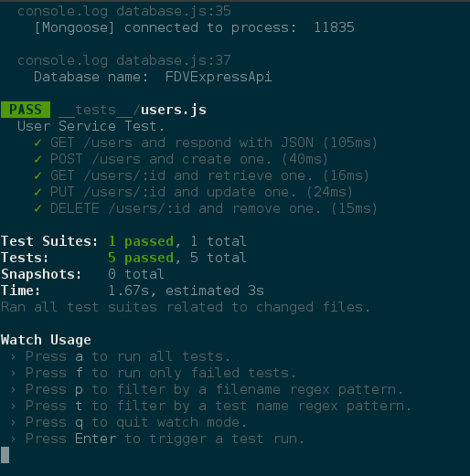
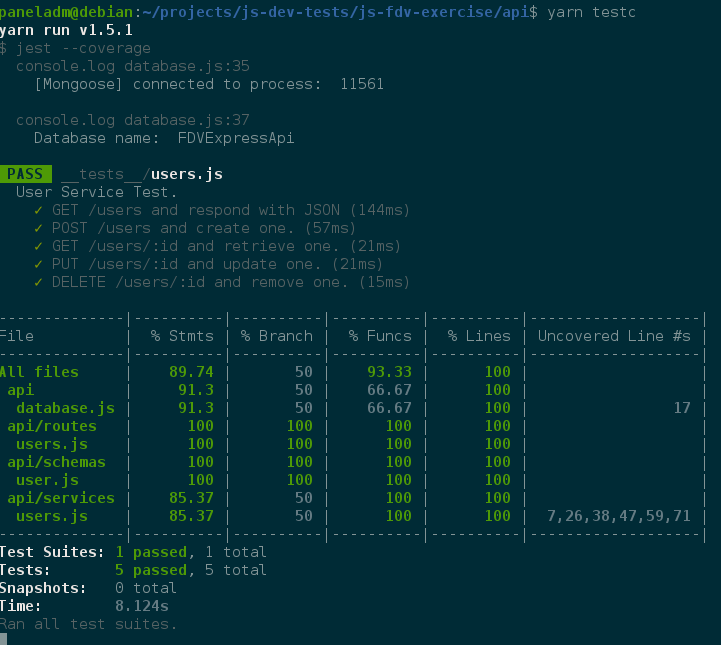

# JavaScript Intive FDV REST API #

Back-End Developer Test by [Intive FDV][1]

Author: [Francis Rodrigues][2]

## Environments ##

* Thinking as a expert
* Airbnb Javascript Style Guide
* Node.js
* Express
* MongoDB
* Mongoose
* EcmaScript 6
* EsLint
* Jest test
* Supertest Mock Request
* Test coverage
* Markdown Lint
* VsCode IDE Editor

## How to run in development machine ##

Running in a console using `npm start` or `yarn start` command.

You can run specifically for development using the command as below:

```bash
~$ yarn run start-dev
```

The output for this command as below:

```bash
$ ./node_modules/eslint/bin/eslint.js . && nodemon server.js
[nodemon] 1.17.3
[nodemon] to restart at any time, enter `rs`
[nodemon] watching: *.*
[nodemon] starting `node server.js`
[Express] Magic happens on port :  5000
[Mongoose] connected to process:  11582
Database name:  FDVExpressApi
```

## How to test it ##

You can run the tests using `npm/yarn` command as below:

```bash
~$ yarn run test
```

The output for this command as below:

```bash
$ jest
  console.log database.js:35
    [Mongoose] connected to process:  13181

  console.log database.js:37
    Database name:  FDVExpressApi

 PASS  __tests__/users.js
  User Service Test.
    ✓ GET /users and respond with JSON (70ms)
    ✓ POST /users and create one. (45ms)
    ✓ GET /users/:id and retrieve one. (15ms)
    ✓ PUT /users/:id and update one. (24ms)
    ✓ DELETE /users/:id and remove one. (14ms)

Test Suites: 1 passed, 1 total
Tests:       5 passed, 5 total
Snapshots:   0 total
Time:        1.545s, estimated 2s
Ran all test suites.
```

You can see test it using `--watch` or `--coverage` parameters.

You also can do it running to commands as below:

* For test watch: `yarn run testw`
* For test coverage: `yarn run testc`

## Screenshots ##





## References ##

* [Airbnb JavaScript Style Guide {}][3]
* [Express - Node.js web application framework][4]
* [MongoDB For Giant IDEAS][5]
* [Mongoose - Elegant MongoDB object modeling for Node.js][6]
* [EcmaScript 6: Feature Overview & Comparison][7]
* [EsLint - The pluggable linting utility for JavaScript and JSX][8]
* [Jest - Painless JavaScript Test][9]
* [Supertest - Super-agent driven library for testing node.js HTTP servers][10]

## License ##

MIT

  [1]: http://intive-fdv.com/
  [2]: https://github.com/francisrod01/
  [3]: https://github.com/airbnb/javascript
  [4]: https://expressjs.com/
  [5]: https://www.mongodb.com/
  [6]: http://mongoosejs.com/
  [7]: https://github.com/rse/es6-features
  [8]: https://eslint.org/
  [9]: https://jest-bot.github.io/jest/
  [10]: https://github.com/visionmedia/supertest
