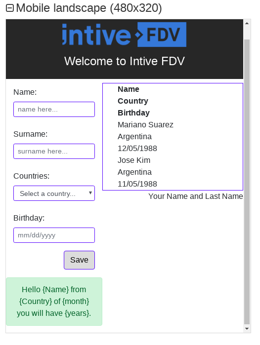
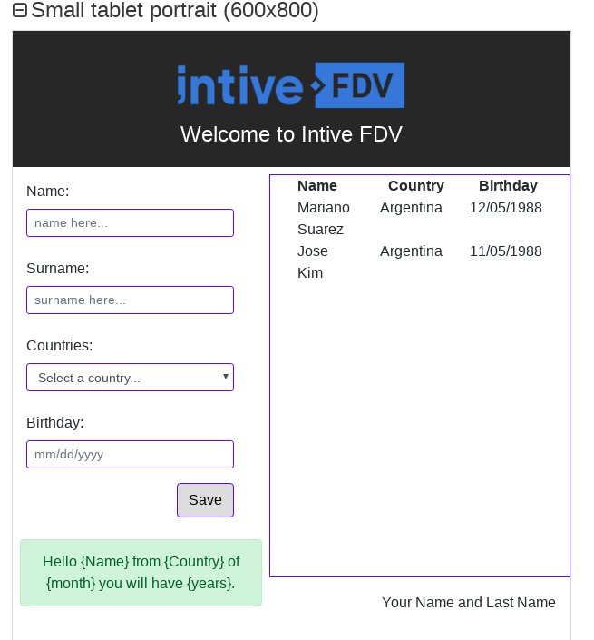
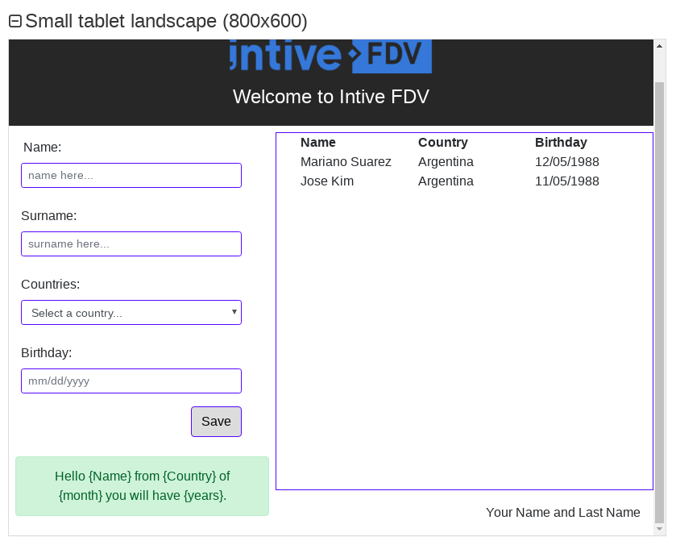
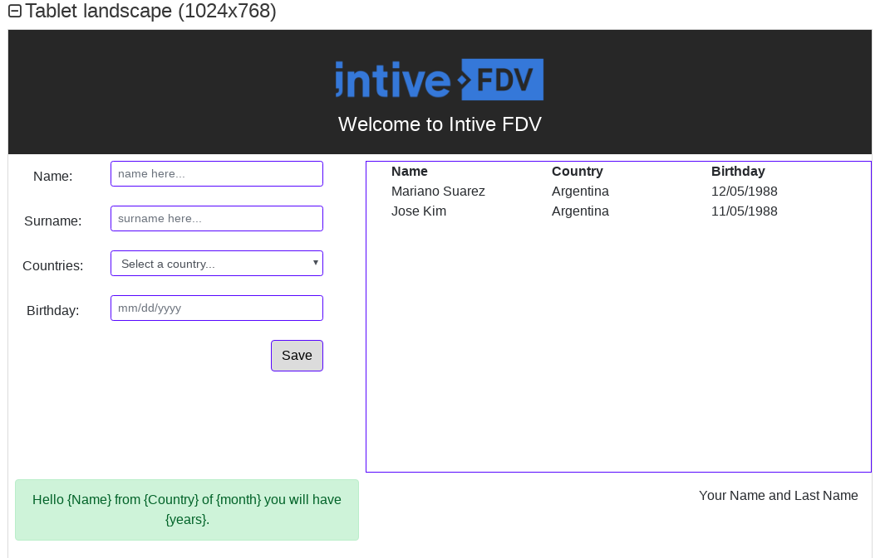

# JavaScript Intive FDV Web app #

ReactJS Developer Test by [Intive FDV][1]

Author: [Francis Rodrigues][2]

## Screenshots ##









## Environments ##

* Web app using:
  * Thinking in Component Structure
  * Airbnb JavaScript, React/JSX Style Guide
  * ReactJS
  * Bootstrap 4
  * EcmaScript 6
  * EsLint
  * Jest test

## How to run in development machine ##

Running in a console using `npm start` or `yarn start` command:

```bash
~$ yarn start
```

The output for this command as below:

```bash
Compiled successfully!

You can now view js-fdv-exercise in the browser.

  Local:            http://localhost:3000/
  On Your Network:  http://192.168.0.104:3000/

Note that the development build is not optimized.
To create a production build, use yarn build.
```

## Using env variables ##

To run this web app using env variables create a `.dev.env` in the root project and type a API url:

```env
API_URL=http://localhost:5000/api/
```

## Rest Countries ##

Get information about countries via a RESTful API.

* [Doc here][7]
* [View on Github][8]

## References ##

* [Bootstrap - Build responsive, mobile-first projects on the web][3]
* [Pass eslint html-has-for with htmlFor in React][4]
* [eslint-plugin-jsx-a11y - Static AST checker for a11y rules on JSX elements][5]
* [Date-fns - Modern JavaScript date utility library][6]

## License ##

MIT

  [1]: http://intive-fdv.com/
  [2]: https://github.com/francisrod01/
  [3]: https://getbootstrap.com/
  [4]: https://github.com/evcohen/eslint-plugin-jsx-a11y/blob/master/docs/rules/label-has-for.mdz
  [5]: https://github.com/evcohen/eslint-plugin-jsx-a11y
  [6]: https://date-fns.org/
  [7]: https://restcountries.eu/rest/v2/all
  [8]: https://github.com/apilayer/restcountries
